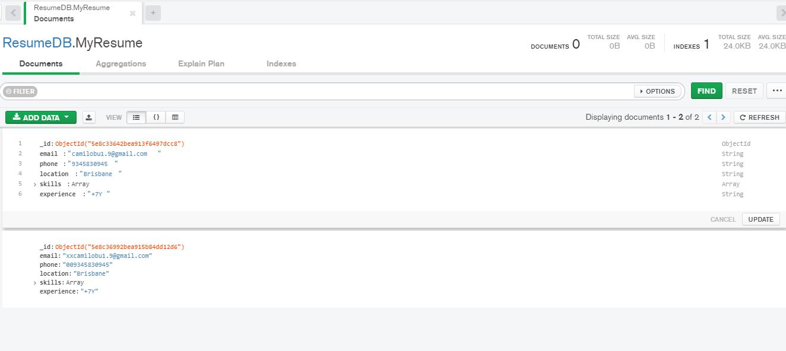

# AgentyJobApplication

App created with Visual Studio 2019

Create a Resume and get the Resume with POST and Get

Create example with POST method from PostMan

Get Resume Data using GET from POSTMAN

MongoDB DataBase 

